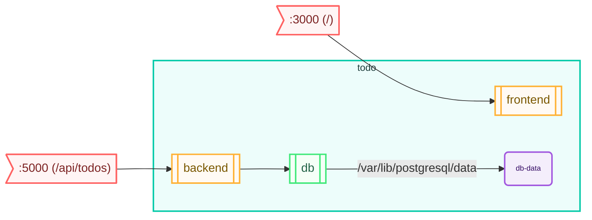

# stack chart

Generate a mermaid graph of the stack

## Synopsis

```bash
stack chart [OPTIONS]
```

## Description

Renders the structure of a stack: its services, which images they run and which
are built locally, how HTTP requests are routed to them, their volumes and their
dependencies on one another. Super stacks are rendered with their component
stacks nested inside.

Two renderers are available, selected with `--format`. Both read the same model,
so the `--show-*` options apply to either.

## Options

| Option | Type | Description | Default |
|--------|------|-------------|---------|
| `--stack` | TEXT | Name or path of the stack | - |
| `--format` | CHOICE | `mermaid` diagram or plain `text` tree | `mermaid` |
| `--show-ports/--no-show-ports` | FLAG | Show port mappings in the chart | False |
| `--show-http-targets/--no-show-http-targets` | FLAG | Show HTTP proxy targets in the chart | True |
| `--show-volumes/--no-show-volumes` | FLAG | Show volume mounts in the chart | True |
| `--direction` | CHOICE | Direction the mermaid diagram flows in (`LR`, `TD`, `TB`, `RL`, `BT`) | `LR` |

## Output Format

### `--format mermaid` (default)

Generates a Mermaid diagram that can be rendered using:
- Mermaid CLI tools
- Markdown renderers with Mermaid support
- Online Mermaid editors

For example, the [example todo list](https://github.com/bozemanpass/example-todo-list)
stack charts as:

````
flowchart LR
  todo-backend-http>":5000 (/api/todos)"]:::http_target
  todo-frontend-http>":3000 (/)"]:::http_target
  todo-backend-http --> todo-backend
  todo-frontend-http --> todo-frontend
  subgraph todo [todo]
    todo-backend[[backend]]:::http_service
    todo-frontend[[frontend]]:::http_service
    todo-db[[db]]:::service
    todo-db-volume-db-data(db-data):::volume
    todo-db --> |/var/lib/postgresql/data|todo-db-volume-db-data
    todo-backend --> todo-db
  end
  classDef stack stroke:#00C9A7,fill:#EDFDFB,color:#1A3A38,stroke-width:2px,font-size:small;
  classDef service stroke:#43E97B,fill:#F5FFF7,color:#236247,stroke-width:2px;
  classDef http_service stroke:#FFB236,fill:#FFFAF4,color:#7A5800,stroke-width:2px;
  classDef http_target stroke:#FF6363,fill:#FFF5F5,color:#7C2323,stroke-width:2px;
  classDef volume stroke:#A259DF,fill:#F4EEFB,color:#320963,stroke-width:2px,font-size:x-small;
  class todo stack;
````

Pasted into a `mermaid` fenced block, that renders as:



This is the same stack the text example below is taken from.

### `--format text`

Prints a tree, for a quick look at a stack in a terminal without rendering
anything:

```
todo
├── backend   bozemanpass/todo-backend:stack (build ./backend)
│     http :5000 -> /api/todos
│     needs db
├── frontend  bozemanpass/todo-frontend:stack (build ./frontend)
│     http :3000 -> /
└── db        postgres:14
      volume db-data -> /var/lib/postgresql/data
```

Ports that are already shown as an HTTP route are omitted under `--show-ports`,
so that the same mapping is not reported twice.

## Examples

```bash
# Generate a basic chart for a stack
stack chart --stack my-stack

# Summarise a stack as text, without rendering a diagram
stack chart --stack my-stack --format text

# Generate a chart showing all details
stack chart --stack my-stack --show-ports

# Generate a minimal chart without volumes
stack chart --stack my-stack --no-show-volumes --no-show-http-targets
```

## See Also

- [stack list](list.md) - List available stacks
- [stack check](check.md) - Dry run of prepare: report what is missing
