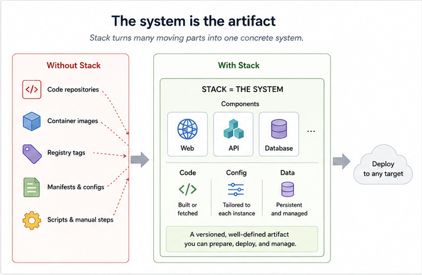
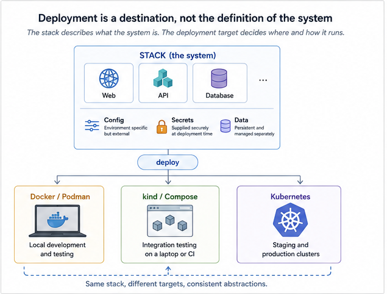

# Stack Concepts

Software developers are accustomed to treating an application as a concrete thing.

An application has source code. It has dependencies. It can be built. A particular version can be identified. The resulting artifact can be installed somewhere, run, upgraded, and removed. Build systems and package managers hide much of the machinery involved, leaving the developer with a relatively small set of abstractions: source, package, version, build, install.

A software *system* is often treated very differently.

A real system may consist of several applications, a database, configuration, persistent data, network services, and software obtained from several repositories. Each application may have its own build procedure. Containers have to be built or obtained from registries. Those containers need names and tags. Configuration must be supplied. Volumes must be created. Services must be connected. Finally, all of this must somehow be expressed in the language of the place where the system is going to run.

The result is that what we think of as "the system" often does not exist as a well-defined object at all. It exists implicitly in a collection of repositories, container images, Compose files, Kubernetes manifests, scripts, CI configuration, and operational knowledge.

Stack starts from a different premise:

> **Treat the whole software system as a first-class software artifact.**

The aim is to provide, for systems, some of the same abstractions that build systems and package managers provide for individual applications.

## The stack is the unit

The fundamental object in Stack is, unsurprisingly, a **stack**.

A stack describes a system made up of related components. A component might be an application developed as part of the system, a database obtained as a pre-built image, a web front end, or some other service required to make the system work.

The important point is that these components are not merely a list of containers which happen to be started together. Collectively, they constitute the system.

This changes the level at which we can think about operations. Instead of building several images, remembering their tags, assembling configuration, creating volumes, and invoking the container runtime correctly, we want to be able to say:

> Prepare this stack, then deploy it there.

That distinction is the central idea behind Stack.

## A build system for systems

Building a non-trivial system frequently means building several things.

Some components may be built from source. Others may already exist as published container images. Source may live in several repositories. A component may need a wrapper to turn software that was not originally distributed as a container into a deployable image.

Stack's `prepare` operation treats these activities as preparation of the *system*, rather than requiring the user to manage each resulting artifact individually.

This is analogous to an application build system. When compiling an application, the developer normally does not regard every intermediate object file as an artifact whose identity must be manually tracked. Those details are part of the build process.

Container images are similarly important implementation artifacts, but they need not become the developer's primary abstraction.

Stack knows which images make up a stack, whether they need to be built or fetched, and which versions belong together. The developer can therefore reason primarily about the version of the system rather than continually translating that idea into a collection of image names and tags.

## A package manager for systems

The analogy extends beyond building.

A package manager takes something potentially complicated—an application plus its dependencies and installation requirements—and turns it into an object which can be acquired and installed.

Stack attempts to do something similar at system scale.

A stack can refer to code and other resources residing in repositories. Those resources can be fetched, the required container images can be built or obtained, and a deployable representation of the resulting system can be produced.

This gives the system something resembling a package lifecycle:

**fetch → prepare → configure → deploy → manage**

The implementation is necessarily different from a conventional package manager, but the conceptual benefit is similar. The user deals with a small number of operations on a well-defined object instead of reproducing the mechanics required to assemble that object.

## Components

A system needs an internal structure if it is to be treated as a concrete object.

Stack models that structure in terms of **components**.

Components are the constituent pieces from which a stack is assembled. They provide a boundary around the source, container definitions, and other material associated with one part of the system.

This matters because real systems rarely have a single provenance. One component may be code we are actively developing. Another may come from a separate repository maintained by somebody else. A third may simply be a standard database image.

Stack allows these differences to exist without making them the organizing principle of the system. From the outside, they are components of one stack.

## Code, configuration, secrets, and data are different things

Running software consists of more than executable code.

Stack deliberately distinguishes several kinds of material which have different lifecycles.

**Code** is built or packaged into the executable artifacts of the system.

**Configuration** describes how a particular instance of the system should behave. It may differ between a developer's laptop, a test deployment, and production without requiring a different version of the software.

**Secrets** are configuration with additional handling requirements. They should not have to be embedded in stack definitions, deployment specifications, or source repositories merely to make deployment convenient.

**Data** is persistent state created by a running system. Unlike a container, it normally survives replacement of the software which created it and may need explicit backup and restoration.

These distinctions sound obvious, but deployment tooling can easily blur them. Stack tries to preserve them because they are useful abstractions for reasoning about the lifecycle of a system.

## Deployment is a destination, not the definition of the system

One of Stack's more important abstractions is the **deployment target**.

The same stack can, within the capabilities of the target, be deployed to a local container environment or to Kubernetes. The stack itself is not defined to *be* a Kubernetes application or a Docker Compose application.

Those are places and mechanisms by which the system can be run.

This is a deliberate inversion of a common approach. It is easy for deployment technology to become the model of the application: once a system is described primarily by Kubernetes objects, for example, Kubernetes concepts inevitably permeate the developer's understanding of the system.

Stack instead tries to put a boundary around those details.

A developer should be able to say that a system contains a web application, an API, and a PostgreSQL database, and separately say that this instance of the system is to be deployed using Compose or to a Kubernetes cluster.

The deployment backend is important, but it is not the identity of the system.

This abstraction is intentionally not perfect. Compose and Kubernetes do not have identical capabilities, and sufficiently specialized deployments will inevitably expose differences between them. The goal is not to pretend that all hosting environments are the same. It is to keep those differences below the abstraction boundary for the large set of ordinary cases where they do not need to dominate the developer's work.

## A deployment is an instance of a stack

It is useful to distinguish the abstract system from a particular installation of it.

A stack says *what the system is*. A deployment says, in effect, *put this version of that system here, with this configuration*.

This makes a deployment conceptually similar to an installed package, although a deployed system carries more state and configuration than most conventional packages.

The deployment directory provides a concrete representation of that installation. It contains the generated material required to operate the deployed system, while the higher-level stack definition remains concerned with what the system consists of.

That separation makes it possible to reason about several deployments of the same stack without confusing them with several different systems.

## Versions belong to the system

Container registries introduce a deceptively awkward problem: a multi-container system has many independently named artifacts.

Suppose a system consists of five locally built images. A particular release therefore appears to have at least five versioned objects. Add externally sourced images and development builds and it becomes surprisingly easy for the meaningful question—

> Which version of the system is this?

—to turn into—

> Exactly which combination of image tags is running?

Stack tries to keep that bookkeeping inside the tooling.

Images still have names and tags because container runtimes and registries require them. But those names are machinery used to realize a version of the stack; they need not be the user's model of versioning.

The useful identity is the identity of the system as a whole.

This becomes especially valuable when moving a system between environments. A developer should not need a handwritten ledger recording which collection of image tags constitutes a known version of the system.

## From laptop to production

Deployment abstraction has another consequence: development and production do not have to be entirely separate worlds.

A developer may run a stack locally using Docker or Podman. A small production installation might use essentially the same model on a persistent host. A larger installation may use Kubernetes.

The infrastructure is different, but the software system need not be reinvented at each stage.

This does not mean pretending that production is just a bigger laptop. Production introduces concerns which genuinely do not exist in a local development environment. Rather, Stack attempts to preserve the things which *should* remain the same—the components, images, configuration model, and identity of the system—while allowing the deployment backend to supply the things which really are different.

The goal is continuity rather than equivalence.

## Batteries included

Stack is intentionally opinionated.

There is always a tradeoff in infrastructure tooling between generality and usefulness. A sufficiently general tool eventually becomes a framework for constructing your own deployment system. That can be exactly what a large organization needs, but it also means that a developer who merely wants to run an ordinary multi-service application must make a large number of infrastructure decisions before anything useful happens.

Stack takes the opposite approach for common cases.

It has opinions about how stacks are structured, how images are named, how deployment artifacts are generated, how persistent volumes are represented, how secrets are supplied, how HTTP ingress is configured, and how deployed systems are operated.

The intention is not to provide every possible mechanism.

It is to make the unsurprising mechanism easy.

The target is the substantial middle ground of software systems which need more than `docker run`, but for which constructing a bespoke application platform would be an unfortunate diversion.

## Stay out of the weeds

Container and orchestration technology necessarily contains a great deal of detail. Much of it is essential to somebody, somewhere. Much less of it is essential to every application developer every day.

Stack tries to keep developers out of those details until they matter.

That is why commands operate on stacks and deployments rather than primarily on individual containers. It is why deployment targets are abstracted. It is why image naming and versioning are handled systematically. It is why common facilities are included rather than left as exercises for each project.

This is not an attempt to eliminate Docker, Podman, or Kubernetes. Stack uses them.

Nor is it an attempt to create a universal platform which encompasses every aspect of developing and operating software. Source control, CI systems, cloud provisioning, observability platforms, and many other concerns remain valuable independent tools.

Stack occupies a particular layer between them.

Below Stack are container runtimes, orchestrators, registries, filesystems, and hosts.

Above Stack is the thing the developer actually cares about:

**the system.**

## The abstraction is the point

It is tempting to evaluate infrastructure tools by counting features: which Kubernetes objects are supported, which registry can be used, which networking options exist.

Those questions matter, but they miss the main purpose of Stack.

The objective is to establish a useful abstraction.

A software system should be something we can name. It should have components. We should be able to obtain its source and dependencies, build it, identify its version, configure it, deploy an instance of it somewhere, operate that instance, preserve its data, and eventually replace or remove it.

The underlying mechanisms do not disappear. They become implementation details behind that model.

Application development became dramatically more manageable once developers stopped treating compilation, linking, dependency resolution, and installation as unrelated collections of commands and started treating an application as an artifact which build systems and package managers could understand.

Stack applies the same idea one level up.

**The system is the artifact.**
