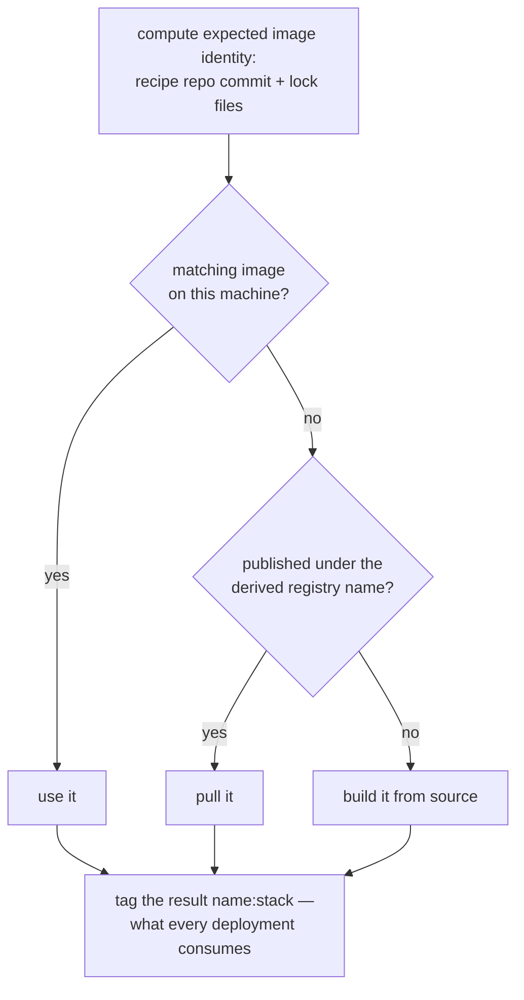
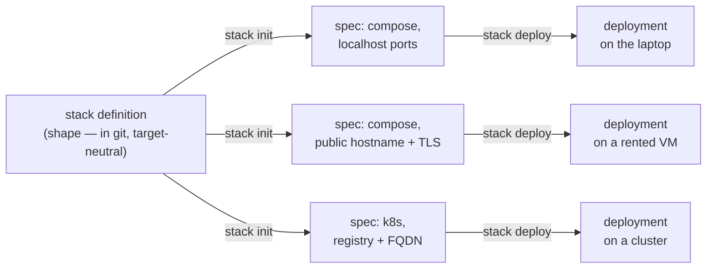

# Stack Concepts

The rest of this documentation describes mechanisms: files, commands, deployment targets.
This page describes the ideas the mechanisms serve. It is the piece to read if you want to
understand not what `stack` does, but why it is shaped the way it is — and it should make
the rest of the documentation feel less like a list of features and more like a small
number of ideas applied consistently.

## The premise: systems deserve what programs already have

Think about what surrounds a single program. It has a build system that turns source into
an artifact, deterministically, from a description checked into the repository. It has a
package format that makes the artifact a concrete thing — nameable, versionable, movable
between machines. It has a package manager that can install it anywhere, resolving what it
needs without the user hand-assembling paths and versions. And it has a versioning scheme
tying every artifact back to the exact source that produced it. This tooling is so
standard that we notice it only when it is missing.

Now think about what surrounds a *system* — the thing you actually ship. A web front end,
an API service, a database, perhaps a worker or two: several cooperating programs plus
their configuration, their data, and the network shape that connects them. This composite
thing is what your users experience as "the application," and it usually has none of that
tooling. It is assembled by hand from container tags, YAML files in several dialects,
provisioning scripts, and knowledge in somebody's head. It has no name, no version, no
build system, and no installer. Each copy of it — the one on your laptop, the one on the
staging VM, the one in production — was constructed separately and drifts separately.

`stack` starts from the position that this is a tooling gap, not a fact of life. It is,
as directly as we could manage, a build system and a package manager whose unit is the
system: the whole assembly is treated as one conceptually concrete artifact that can be
named, built, versioned, installed, started, backed up, and moved.

## The system as an artifact: the stack

The artifact is called a **stack**, and it is defined by a small file, `stack.yml`,
checked into an ordinary git repository (see [stack-files.md](./stack-files.md)). A stack
declares:

- its **containers** — the components, each tied to the source repository and recipe that
  builds it;
- its **pods** — groupings of containers that deploy together, each described by a
  composefile in ordinary Docker Compose syntax;
- its **secrets** — which environment variables must exist but must never be written
  down;
- and, through the composefiles, its configuration surface, its named data volumes, and
  the service names by which its components reach each other.

Two things about this definition matter more than its syntax.

First, **it describes shape, not versions**. The stack says which components exist, how
they are built, and how they connect. It does not embed image tags, registry URLs, or
host paths. Those are either derived (versions, as described below) or supplied at
deployment time (paths, hostnames, targets). This is the same separation a language
package manifest makes between "what I depend on" and the lock file's "exactly which
build I got," and it is what lets one definition serve every environment.

Second, **it is complete**. Given the stack definition and the repositories it
references, `stack` can build every image, generate every deployment artifact, and start
the system, with nothing assembled by hand in between. The definition is not
documentation of a system that really lives somewhere else; it *is* the system, in the
same sense that a package's build manifest is the package.

## The anatomy: code, config, data, and a place to run

A running system decomposes into a small number of distinct concerns, and `stack` keeps
them distinct on purpose — most of the day-to-day confusion in operating software comes
from tools that blur them.

**Code** becomes container images, built from source by recipes the stack points at. A
recipe can be a `Dockerfile`, a `build.sh`, or a `container.yml` — and notably, the
recipe need not live in the repository it builds, which is how you build customized
images from source you do not control. For the common case where the source is an
ordinary web application with no container build of its own, **wrappers**
([wrappers.md](./wrappers.md)) supply the whole recipe: declare `wrapper: nextjs` or
`wrapper: static-content` and the source repository never has to know it is destined for
a container at all. This is the "batteries included" posture applied to building: the
well-trodden shapes should cost one line.

**Configuration** is environment variables, because that is the one configuration
mechanism every containerized program already understands. The stack's composefiles
declare what is configurable and with what defaults; a deployment supplies values in its
`config.env`; precedence between the two is fixed, documented, and — this is the part
that takes discipline — *identical on every deployment target*. A program cannot tell
from its environment whether it was configured by Docker Compose or by Kubernetes.

**Secrets** are configuration that must never be written down, and they get exactly one
extra distinction ([secrets.md](./secrets.md)): the stack declares *which* variables are
secret, the deployment records *where each value comes from* — generated, or a reference
to an external source — and the value itself appears in no file. The containers still
see ordinary environment variables; the application code is untouched.

**Data** is named volumes. The stack's composefiles declare that the database has a data
volume; the deployment decides where those bytes physically live
([volumes.md](./volumes.md)) — a directory inside the deployment on a laptop, a
PersistentVolumeClaim on a cluster, a specific path on a node when the data must be
somewhere in particular. The component knows it has durable storage; only the deployment
knows the storage's address. Backups ([backup.md](./backup.md)) follow the same split:
the stack can declare what a correct backup of a component *is* (down to "stream a
database dump instead of copying files"), while the deployment decides where backups go.

**The place to run** is the concern `stack` works hardest to remove, and it gets its own
section below.

One consequence of this decomposition is worth calling out: because code, config, data,
and placement are separate declarations, each can change without disturbing the others.
Rebuilding a component does not touch your data; moving a deployment to a bigger machine
does not touch the stack definition; rotating a secret does not touch the code.

## Versioning: nobody should curate container tags

The standard container workflow makes the developer the version-bookkeeper. You choose
tags, remember to bump them, keep the compose file's idea of the version synchronized
with what CI pushed, and debug the inevitable day those disagree. A system of eight
images has eight of these threads to hold. This is the maze `stack` is designed to keep
you out of, and the way out is the same one source control found long ago: **identity is
computed from content, not chosen by a person.**

An image's version is the commit hash of the repository holding its build recipe, with
lock files pinning any inputs that live elsewhere, so that one hash fully determines the
image's content ([image-names.md](./image-names.md)). The registry an image is published
to is likewise derived from where its recipe repo is hosted. Given nothing but the stack
definition, `stack` can therefore compute, for every component, exactly what the image is
called and where it lives — which is precisely the property a package manager needs, and
it is why `stack prepare` can find prebuilt images with zero configuration.

The stack's own files never mention any of this. A composefile names its image as
`exampleorg/myapp:stack` — a deliberate placeholder meaning "the image for this
component, as built or prepared here" — and the tooling substitutes real, derived
versions at the appropriate moments. Uncommitted work gets a synthetic `stackdev-`
version that is refused for publication, so an image that cannot be reproduced from a
commit can never impersonate one that can. The developer's contract with the versioning
scheme is simply: commit your work (including lock files), and every artifact is
traceable to source; don't, and the tooling will still build and deploy your tree
locally, clearly marked as unreproducible.

The effect in practice is that "what version is running?" and "get me the images for
commit X" are questions the tooling can always answer, and that no human ever composes,
bumps, or reconciles a tag.

## The package manager for systems

With identity derived rather than declared, the package-manager behaviour falls out
naturally. `stack fetch` clones what a stack needs. `stack prepare` is `install`: for
each component it computes the expected image identity, uses a local image that matches,
pulls a published one if the registry has it, and builds from source only when neither
exists. On a machine that has never seen the source, preparing a published stack is
almost entirely downloads; on the developer's machine it is almost entirely builds; the
command and the result are the same.

Third-party images (`postgres:16`) ride along,
pinned by digest in the lock file so the system's *entire* content is reproducible, not
just the parts you wrote.

And like any package manager's artifacts, stacks compose: a stack can include other
stacks, so "my application" can be assembled from "the database stack, the ingress
stack, and mine" without any of them knowing about the others.

## The place to run is a parameter

Deployment tooling usually makes the target the organizing concept: you write "a compose
setup" or "Kubernetes manifests," and the system's definition is trapped inside the
dialect of wherever it happens to run. `stack` inverts this. The stack definition is
target-neutral; a **spec**, generated by `stack init`, binds it to a target — local
Docker, a Kubernetes cluster, or Kubernetes-in-Docker for testing the cluster shape
locally — together with the target-shaped decisions: hostnames, port mappings, volume
placement, an image registry when the target needs one.

One definition, any number of specs; each spec, any number of installed instances. The
arrows only point rightward — nothing a deployment needs is ever written back into the
definition, and that one-way flow is what keeps the definition portable.

Calling the target "abstracted" is a strong claim, and it is only honest because the
contracts a program can observe are kept identical across targets: the same environment
variable precedence, the same service-name DNS between components, the same volume
semantics, the same secrets delivery. The differences that remain are genuinely about
the environment (a cluster needs a registry to pull from; a laptop does not) and they
live in the spec, visibly, rather than leaking into the stack.

The payoff is a continuity that is rare in practice
([from-laptop-to-production.md](./from-laptop-to-production.md)): the system you develop
against local Docker is the system you deploy to a five-dollar VM to serve real users,
is the system you move to a cluster if you ever genuinely need one — the same
definition, re-`init`ed with a different target, with an exit door open at every step
because nothing about the definition belongs to any platform.

## The deployment: an installed instance you can point at

Creating a deployment (`stack deploy`) produces a directory, and the directory *is* the
installed system: the generated artifacts, the `config.env`, and (locally) the data
directories, all in one place. This is the package-manager idea completing itself —
install produces a concrete installation — and it has concrete virtues: two deployments
of the same stack on one machine cannot interfere; backing up or moving a local
deployment is backing up or moving a directory; and "what exactly is this instance
running, with what config?" is answered by looking, not by archaeology.

Every instance is then driven through one verb set — `stack manage --dir <dir>
start|stop|status|logs|exec|update` — that means the same thing on every target.
`update` deserves the last word here, because it is the converge operation that makes
the whole model livable: after a rebuild or a config edit it recreates exactly the
containers whose image or configuration actually changed and leaves the rest running.
The developer's loop is *edit, prepare, update*, on a laptop or against a real cluster
alike.

## Batteries included, weeds excluded

`stack` does not try to address everything about application development and hosting,
and the boundary is drawn on purpose. The aim is to cover a decent proportion of what
ordinary systems ordinarily need — building, versioning, configuration, secrets, data,
HTTP ingress with real TLS certificates, backups, the deployment lifecycle — so that the
common path never sends you into the weeds, while declining to grow a proprietary
surface for everything else.

Three principles govern the boundary:

**Least surprise.** Where a convention already exists, `stack` adopts it rather than
inventing: pod files are Docker Compose syntax, configuration is environment variables,
specs and stack files are plain editable YAML, repositories are ordinary git. Someone
who knows the container ecosystem should find each individual piece familiar and only
the coherence new.

**Low weeds.** Defaults are chosen so the well-trodden path requires no decisions: volume
placement, image naming, registry selection, and port wiring all have derived or
generated answers that most deployments never revisit. The measure of success is how
much of this document a newcomer can remain unaware of while shipping.

**No trap doors.** Everything generated is inspectable, everything is a file, and the
underlying engines are not hidden — a deployment directory can be examined with the same
`docker` or `kubectl` you already know. Abstraction here means you are not *required* to
deal with the layer below, never that you are prevented from it.

And the things `stack` is deliberately not: not a hosting platform (it produces systems
that run on infrastructure you choose and control); not a CI/CD system (though it slots
into one naturally, since builds are reproducible from commits); not a general workflow
engine or a new orchestration language. It is the toolchain a system was missing — a way
to make the thing you actually ship as concrete, buildable, versionable, and installable
as any single program has always been.
