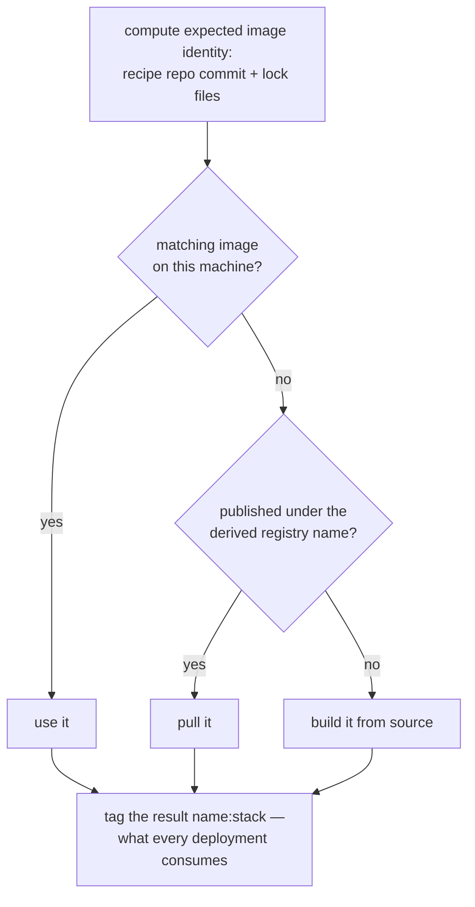
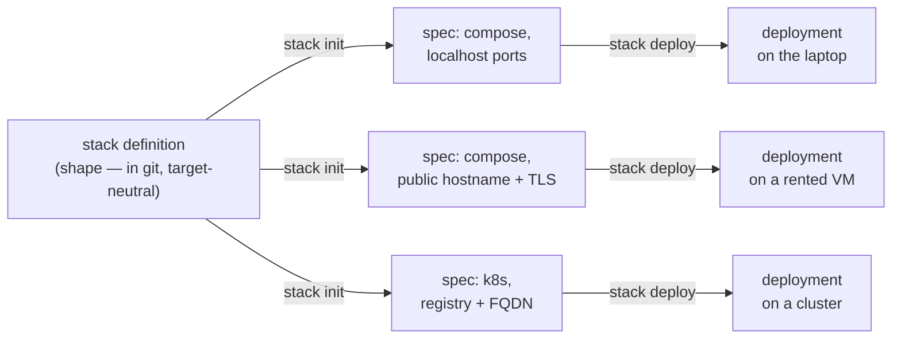

# Stack Concepts

The rest of the documentation covers mechanics: files, commands, deployment targets. This
page covers the ideas underneath. Read it first and the rest should feel like a small
number of ideas applied repeatedly, rather than a pile of features.

## Systems deserve the tooling that programs already have

A single program comes surrounded by good tooling. There's a build system that turns
source into an artifact from a description checked into the repo. There's a package
format, so the artifact is a concrete thing with a name and a version that can be moved
between machines. There's a package manager that installs it anywhere without anyone
hand-assembling paths and versions. All of this is so standard that we only notice it
when it's missing.

But the thing you actually ship is rarely a single program. It's a web front end, an API
service, a database, maybe a worker or two: several cooperating programs plus their
configuration, their data, and the wiring between them. That composite is what your users
mean by "the application", and it usually has none of the above. It gets assembled by
hand out of container tags, YAML in several dialects, provisioning scripts, and knowledge
in somebody's head. It has no name, no version, no installer. The copy on your laptop and
the copy in production were constructed separately and they drift separately.

We think that's a tooling gap, not a fact of life. `stack` is an attempt to fill it: a
build system and package manager whose unit is the system. The whole assembly becomes one
concrete artifact that can be named, built, versioned, installed, started, backed up, and
moved somewhere else.

## The artifact: a stack

The artifact is called a stack. It's defined by a small file, `stack.yml`, checked into
an ordinary git repository (see [stack-files.md](./stack-files.md)), which declares:

- the **containers** — the components, each tied to the source repo and the recipe that
  builds it;
- the **pods** — groups of containers that deploy together, each described by a
  composefile in ordinary Docker Compose syntax;
- the **secrets** — environment variables that must exist but must never be written down;
- and, via the composefiles, the configuration surface, the named data volumes, and the
  service names the components use to reach each other.

The syntax is less important than two properties of the definition.

It describes shape, not versions. The stack says which components exist, how they're
built, and how they connect. It does not embed image tags, registry URLs, or host paths —
versions are derived (more below), and paths and hostnames are supplied at deployment
time. This is the same split a package manifest makes between "what I depend on" and the
lock file's "exactly what I got", and it's what lets one definition serve every
environment.

And it's complete. Given the stack file and the repos it references, `stack` can build
every image, generate every deployment artifact, and start the system. There is no
hand-assembly step in the middle. The definition isn't documentation of a system that
really lives somewhere else; it *is* the system.

## Code, config, data, and a place to run

A running system breaks down into a few distinct concerns, and `stack` keeps them
distinct on purpose. A lot of everyday operational confusion comes from tools that blur
them.

**Code** becomes container images, built by recipes the stack points at. A recipe can be
a `Dockerfile`, a `build.sh`, or a `container.yml` — and it doesn't have to live in the
repo it builds, which is how you build customized images from source you don't control.
For the common case of a web app with no container build of its own, a wrapper
([wrappers.md](./wrappers.md)) supplies the whole recipe: say `wrapper: nextjs` or
`wrapper: static-content` and the source repo never needs to know it's headed for a
container. The well-trodden shapes should cost one line.

**Configuration** is environment variables, because that's the one configuration
mechanism every containerized program already understands. The composefiles declare
what's configurable and the defaults; a deployment supplies values in its `config.env`;
the precedence between them is fixed and — this took some discipline — identical on every
target. A program can't tell from its environment whether Docker Compose or Kubernetes
configured it.

**Secrets** are configuration that must never be written down, and that's the only
distinction they get ([secrets.md](./secrets.md)). The stack declares *which* variables
are secret; the deployment records where each value comes from — generated, or a
reference to something external — and the value itself appears in no file. The containers
just see environment variables. Application code doesn't change.

**Data** is named volumes. The composefiles declare that the database has a data volume;
the deployment decides where the bytes live ([volumes.md](./volumes.md)) — a directory
inside the deployment on a laptop, a PVC on a cluster, a specific node path when the data
has to be somewhere in particular. The component knows it has durable storage; only the
deployment knows the address. Backups ([backup.md](./backup.md)) split the same way: the
stack can say what a correct backup of a component *is* (down to "stream a database dump,
don't copy the files"), the deployment says where backups go.

**The place to run** gets its own section below, because it's the concern `stack` works
hardest to remove.

Because these are separate declarations, each can change without disturbing the others.
Rebuilding a component doesn't touch your data. Moving to a bigger machine doesn't touch
the stack definition. Rotating a secret doesn't touch the code.

## Versioning, or: nobody should curate container tags

The standard container workflow makes you the version-bookkeeper. You choose tags, you
remember to bump them, you keep the compose file's idea of the version in sync with what
CI pushed, and eventually you spend an afternoon debugging the day they disagreed. A
system of eight images gives you eight of these threads to hold.

We wanted out of that maze entirely, and the way out is one source control found a long
time ago: identity is computed from content, not chosen by a person.

An image's version is the commit hash of the repo holding its build recipe, with lock
files pinning any inputs that live elsewhere, so one hash fully determines the image's
content ([image-names.md](./image-names.md)). The registry it's published to is likewise
derived, from where the recipe repo is hosted. So given nothing but the stack definition,
`stack` can compute what every image is called and where it lives — which is exactly the
property a package manager needs, and it's why `stack prepare` finds prebuilt images with
zero configuration.

The stack's own files never mention any of this. A composefile names its image
`exampleorg/myapp:stack`, a deliberate placeholder meaning "the image for this component,
as built or prepared here", and the tooling substitutes real versions at the right
moments. Uncommitted work gets a synthetic `stackdev-` version that is refused for
publication, so an image that can't be reproduced from a commit can never impersonate one
that can. Your whole contract with the versioning scheme is: commit your work, including
the lock files. (Don't, and things still build and deploy locally — just marked as
unreproducible.)

In practice this means "what version is running?" and "get me the images for commit X"
are questions the tooling can always answer, and no human ever composes, bumps, or
reconciles a tag.

## The package manager part

Once identity is derived rather than declared, package-manager behaviour follows.
`stack fetch` clones what a stack needs. `stack prepare` is install: for each component,
compute the expected image identity, use a local image that matches, pull a published one
if the registry has it, and only build from source when neither exists.

On a machine that has never seen the source, preparing a published stack is nearly all
downloads. On the developer's machine it's nearly all builds. Same command, same result.
Third-party images (`postgres:16`) ride along, pinned by digest in the lock file, so the
*entire* content of the system is reproducible — not just the parts you wrote.

Stacks also compose, like any package manager's artifacts: a stack can include other
stacks, so "my application" can be the database stack plus the ingress stack plus yours,
none of them knowing about the others.

## The place to run is a parameter

Deployment tooling usually makes the target the organizing concept. You write "a compose
setup", or "the Kubernetes manifests", and from then on your system's definition is
trapped in the dialect of wherever it happens to run. `stack` inverts this: the stack
definition is target-neutral, and a spec, generated by `stack init`, binds it to a target
— local Docker, a Kubernetes cluster, or Kubernetes-in-Docker for testing the cluster
shape locally — along with the target-shaped decisions: hostnames, port mappings, volume
placement, an image registry if the target needs one.

One definition, any number of specs; each spec, any number of installed instances. Note
the arrows only point right. Nothing a deployment needs is ever written back into the
definition, and that one-way flow is what keeps the definition portable.

"Abstracted" is a strong claim, and it's only honest because the contracts a program can
observe are kept identical across targets: the same environment variable precedence, the
same service-name DNS between components, the same volume semantics, the same secrets
delivery. The differences that remain are genuinely about the environment — a cluster
needs a registry to pull from, a laptop doesn't — and they live in the spec, visibly,
instead of leaking into the stack.

What you get for this is a continuity that's rare in practice
([from-laptop-to-production.md](./from-laptop-to-production.md)): the system you develop
against local Docker is the system you deploy to a five-dollar VM to serve real users, is
the system you move to a cluster if you ever genuinely need one. Same definition,
re-`init`ed with a different target. Nothing about it belongs to any platform, so the
exit door is open at every step.

## The deployment: an installed instance you can point at

`stack deploy` produces a directory, and the directory *is* the installed system: the
generated artifacts, the `config.env`, and (locally) the data directories, all in one
place. This has mundane but real virtues. Two deployments of the same stack on one
machine can't interfere. Backing up or moving a local deployment means backing up or
moving a directory. And "what exactly is this instance running, with what config?" is
answered by looking at it, not by archaeology.

Every instance is driven through the same verbs — `stack manage --dir <dir>
start|stop|status|logs|exec|update` — and they mean the same thing on every target.
`update` is the one that makes the whole model livable day to day: after a rebuild or a
config edit, it recreates exactly the containers whose image or configuration actually
changed and leaves the rest running. The development loop is edit, prepare, update —
whether the deployment is on your laptop or a real cluster.

## Batteries included, weeds excluded

`stack` doesn't try to address everything about application development and hosting. The
aim is to cover a decent proportion of what ordinary systems ordinarily need — building,
versioning, configuration, secrets, data, HTTP ingress with real TLS certificates,
backups, the deployment lifecycle — so the common path never sends you into the weeds,
without growing a proprietary surface for everything else.

A few principles keep the boundary where it is.

Least surprise: where a convention already exists, adopt it. Pod files are Docker Compose
syntax. Configuration is environment variables. Specs and stack files are plain editable
YAML, and repositories are ordinary git. If you know the container ecosystem, each piece
should look familiar; only the coherence is new.

Low weeds: the defaults are chosen so the well-trodden path requires no decisions. Volume
placement, image naming, registry selection, and port wiring all have derived or
generated answers that most deployments never revisit. A fair measure of success is how
much of this document someone can remain unaware of while shipping.

No trap doors: everything generated is inspectable, everything is a file, and the engines
underneath aren't hidden — you can poke at a deployment with the same `docker` or
`kubectl` you already know. The abstraction means you aren't *required* to deal with the
layer below. It never means you're prevented from it.

And to be clear about what `stack` is not: it's not a hosting platform (it produces
systems that run on infrastructure you choose and control), it's not a CI/CD system
(though it slots into one naturally, since builds are reproducible from commits), and
it's not a new orchestration language. It's the toolchain the system was missing — a way
to make the thing you actually ship as concrete, buildable, versionable, and installable
as a single program has always been.
