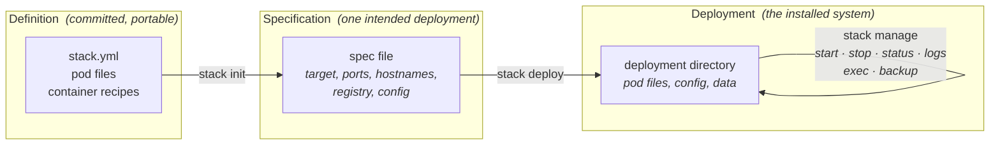
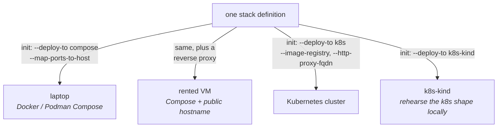

# Stack Concepts

Most of this documentation explains how to *use* `stack`: which files to write, which
commands to run, which flags to pass. This page explains the ideas underneath — what kind
of thing a stack is, why the tool is shaped the way it is, and which problems it is
deliberately choosing to solve (and not solve). If the reference pages are the map, this
is the geography.

## The missing tool

A single program has enjoyed good tooling for decades. Its source is compiled by a build
system that knows what depends on what. Its libraries come from a package manager that
resolves versions and records them in a lock file. Installing it puts a known artifact in
a known place, and the package manager can later upgrade, verify, or remove it. The
program is treated, throughout, as *one thing* with well-defined inputs and a well-defined
identity.

A *system* of programs — a web front end, an API service, a database, perhaps a worker or
two — has never had the equivalent. The pieces are individually well tooled, but the whole
is customarily held together by convention and glue: a compose file here, some shell
scripts there, a wiki page explaining which container tags go together, and a deployment
procedure that lives partly in CI configuration and partly in someone's head. The system
exists as a concept in its developers' minds, but nowhere is it an artifact that a tool
can build, version, install, and manage.

Stack's premise is that this is a tooling gap, not a fact of nature. The system deserves
to be a concrete, first-class entity — something with a name, a definition, a build, a
version, and an installed form — and the tool for it should feel like the build systems
and package managers we already know. `stack fetch` and `stack prepare` are the build
system. Lock files and image publishing are the package manager. `stack deploy` is the
installer, and `stack manage` operates the installed result.

## What a stack is made of

A stack is described by a small set of declarative files, committed alongside (or near)
the code they describe. The top of the hierarchy is `stack.yml`, which gives the system
its name and enumerates its parts. Those parts fall into a handful of well-formed
abstractions, and it is worth being precise about each.

**Containers** are the units of code. Each entry in the `containers` list names an image
and says where its source lives (`ref`, a git repository reference) and where its build
recipe lives (`path`, plus optionally `content-root` to narrow what actually gets built).
The recipe can be a `Dockerfile`, a `build.sh`, or a `container.yml` — and notably, the
recipe and the source need not live in the same repository, which makes it practical to
build customized images from upstream code you don't control. For common shapes of
application there need be no recipe at all: a *wrapper* such as `static-content`,
`nextjs`, or `node-service` supplies the entire containerization, so a repository of
pages or a Next.js app becomes deployable without containing a single Docker artifact.

**Pods** are the units of composition. A pod groups containers that deploy together and
is described by a `composefile.yml` — deliberately compatible with `docker-compose.yml`
syntax, because that format is widely understood and already expresses the right things:
services, volumes, environment, ports. A pod may also declare `pre_start_command` and
`post_start_command` hooks for initialization that belongs to the system rather than to
any one container.

**Configuration** is layered with defined precedence: values supplied at deployment time
in `config.env` override `env_file:` entries, which override a service's inline
`environment:` block. This is the same order Docker Compose uses, and Stack applies it
identically on Kubernetes, so a pod file hands its containers the same values whichever
target it lands on.

**Secrets** are configuration whose values must never appear in the committed files or
the deployment artifacts. A stack declares that a secret *exists*; the value is injected
at deploy time — generated automatically by default, or supplied by reference when the
secret's counterpart lives outside the deployment (an SMTP password, say).

**Data** lives in named volumes declared in the pod files, and the deployment machinery
knows about it: backing up and restoring state is a `stack manage` operation, not an
exercise left to the reader.

**Connectivity** inside a deployment follows one simple rule: every service can reach
every other service by its service name, across pod boundaries, on every deployment
target. On Kubernetes each deployment gets its own namespace so the unqualified names
resolve; on Compose the network does the same job. Code never needs to know which world
it is running in.

The point of enumerating these is not the individual features but the claim they add up
to: components, code, config, data, and connectivity are each *somewhere definite* in the
model. When you wonder "where does X belong?", there is an answer, and it is the same
answer for every stack.

## Definition, specification, deployment

Stack keeps three layers strictly apart, and most of its ergonomics flow from this
separation.

The **definition** is the stack itself — `stack.yml`, the pod files, the container
recipes. It is committed to a repository, it is portable, and it says nothing about where
the system will run. This is the analogue of source code plus its build description.

The **specification** is what `stack init` produces: the definition combined with a set
of choices for one intended deployment — the target (`--deploy-to compose` or `k8s`),
port mappings, hostnames, an image registry, configuration values. It is a single YAML
file you can inspect, edit, commit, and reuse. This is the analogue of a build
configuration: same source, different `./configure` flags.

The **deployment** is what `stack deploy` creates from a specification: a self-contained
directory holding everything the running instance needs — its copies of the pod files,
its configuration, its data volume locations. From then on the deployment directory *is*
the installed system, and `stack manage --dir <dir>` starts it, stops it, shows its
status and logs, executes commands inside its services, and backs it up. Two deployments
of the same stack are simply two directories; they don't share mutable state and can't
interfere with each other.

The payoff of the layering is that moving a system between worlds never touches the
definition. The [README quick start](../README.md) deploys the same todo stack to local
Docker and then to a Kubernetes cluster, and the diff between the two is confined to the
`stack init` invocation. Which brings us to the next idea.

## The place to deploy is an abstraction

"Where the system runs" is, in Stack's model, a *parameter* — chosen at init time, not
woven through the definition. Today the parameter takes three values: Docker/Podman
Compose (the development loop, and equally a small production server), Kubernetes (real
clusters, when scale or multi-tenancy genuinely calls for one), and `k8s-kind`
(Kubernetes-in-Docker, for developing the k8s shape of a deployment without renting a
cluster).

Abstracting the target is only honest if the semantics hold steady across it, so Stack
works to make them hold: service-name resolution behaves identically, environment
precedence behaves identically, the manage lifecycle (start, stop, status, logs, exec,
backup) is the same set of verbs everywhere. What changes per target is confined to
things that genuinely differ — a Kubernetes deployment needs an image registry to pull
from and a public hostname for its ingress, so those appear as init flags and a
`push-images` step, and nothing else changes.

One consequence deserves emphasis, because it cuts against the prevailing current: this
design makes ordinary infrastructure sufficient. A definition that deploys unchanged to a
laptop, a rented VM, or a cluster means the decision between them is reversible, and the
sensible default for a system with real users is often the humblest option — one small VM
running the Compose target, described at more length in
[From Laptop to Production](./from-laptop-to-production.md). Stack is in this sense the
PaaS-free alternative: the "define once, deploy with one command" convenience, without
the pricing curve, the platform's opinions about what you may run, or the proprietary
configuration that makes leaving expensive.

## Versioning without the tag maze

Container tags are the weakest link in most multi-container workflows. They are mutable,
they are invented by hand or by CI convention, and nothing ties a tag to the source that
produced the image. Multiply by several images per system and you get the familiar maze:
which `api:2024-11-eks-fix2` goes with which `frontend:latest`?

Stack removes the maze by refusing to let humans (or CI scripts) make up image identities
at all. An image's identity *is* the commit hash of its recipe repository — the repo
carrying its `container.yml`, or failing that the repo carrying the `stack.yml` that
declares it. In the common case where recipe and source are the same repository, the
image identity is simply that repo's commit hash: check out a commit, and the images that
belong with it are fully determined.

Where the inputs span repositories — a recipe building someone else's source, or a
wrapper supplying the containerization — lock files (`container.lock`, `stack.lock`)
committed in the recipe repo pin the other repositories' commits, so that a recipe commit
still fully determines image content, exactly as a `Cargo.lock` or `package-lock.json`
makes a dependency tree reproducible. Third-party images named in pod files (`postgres:14`
and the like) are pinned too, by manifest digest, recorded at prepare time and applied at
deploy time; an image can opt out with an explicit `# @stack unpinned` annotation, making
floating versions a visible, deliberate choice rather than the silent default.

And when the tree is dirty — uncommitted changes, including a not-yet-committed lock
file — the build gets a synthetic `stackdev-` tag that is never published and never
matched remotely. The invariant this protects is worth stating plainly: **any image
identity that can circulate corresponds to committed code.** Committing is what
stabilizes identity, in containers just as in source control.

The package-manager half of the analogy follows directly. Because identities are
deterministic, prepared images can be published to a registry and later *matched* instead
of rebuilt — a colleague (or a production host) that fetches the same commits can pull
the same images, byte for byte, the way a package manager pulls a prebuilt artifact
rather than compiling from source. The developer never names a tag in any of this; tags
have become an implementation detail of the tool, which is where they belong.

## Batteries included, least surprise, low weeds

Three phrases recur when we explain Stack's design temperament, and they are meant
seriously enough to define here.

**Batteries included** means the normally encountered needs of a web system are covered
in the box, not left as integration exercises: building images (or wrapping repos that
have none), secrets generation, cross-service networking, ingress and HTTPS on public
targets, backup and restore, log access, and the integrity tooling — `stack validate` to
check that the stack's files agree with each other, `stack check` to dry-run a prepare,
`stack chart` to draw the system. You should be able to go from a cloned repository to a
running, reachable, backed-up system without leaving the tool.

**Least surprise** means behavior transfers. The compose syntax is the one you already
know. Environment precedence is the one Docker Compose already defined. What works
locally works the same way on a VM and the same way on a cluster, because a promise of
target abstraction is only as good as the uniformity behind it. Defaults are chosen so
that the naive first command does the reasonable thing, and deviations from defaults
(an unpinned image, an external secret) are explicit marks in the files rather than
ambient state.

**Low weeds** means the tool keeps you at the level of the system. You reason about
stacks, containers, pods, and deployments; you do not hand-manage image tags, wire up
per-target networking, or template YAML for two orchestrators. The weeds still exist —
they always do — but visiting them becomes optional. And when you need to: every
abstraction here has an escape hatch. A `build.sh` may do anything a shell can do; a pod
file is real compose syntax, not a subset; hooks run arbitrary commands at defined
moments; and a deployment directory is ordinary files you can read.

## What Stack is not

A concepts page should be honest about boundaries. Stack does not aim to address all
aspects of application development and hosting, and saying so is part of the design.

It is not a PaaS: there is no hosted control plane, no billing meter, and nobody carrying
the pager for you. It is not an orchestrator: scheduling and supervising containers is
Docker's and Kubernetes' job, and Stack drives them rather than replacing them. It is not
a CI system, an infrastructure provisioner (companion tooling exists for creating hosts,
but it is deliberately separate), or a monitoring suite. And it will not cover every
exotic topology — the aim is a decent proportion of all normally encountered systems,
handled well, rather than every conceivable system handled via configuration sprawl.

What it is, is the tool that makes the *system* the unit of thought: one definition, built
reproducibly, versioned without ceremony, deployable to an abstracted "somewhere" with
one command, and manageable afterward as the single entity it always conceptually was.
The rest of the documentation shows how; start with the
[README quick start](../README.md), then [stack-files.md](./stack-files.md) for the file
formats and [commands.md](./commands.md) for the verbs.
